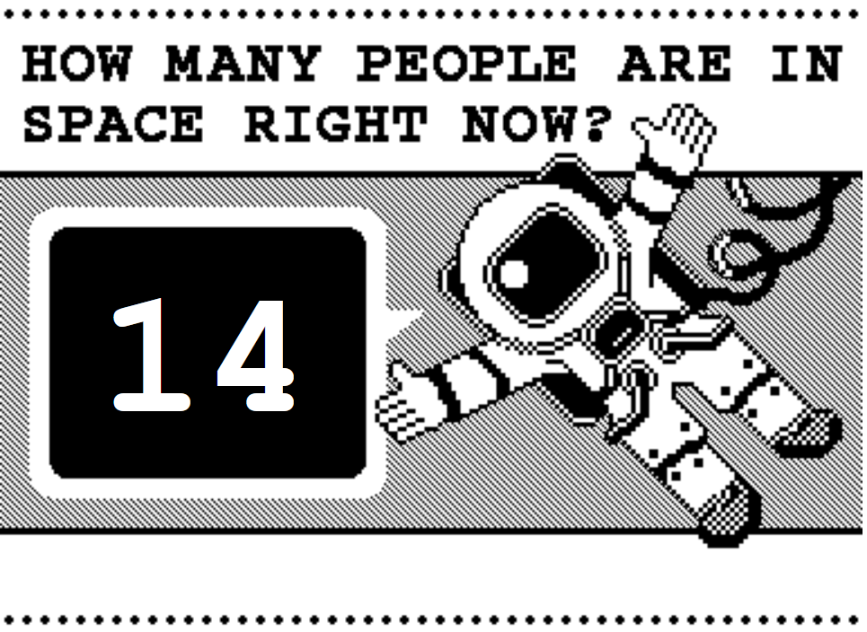

```
$ bundle install
$ rerun ruby app.rb
```

When you run this application it generates a web page which looks like this:



The images in public/images and index.erb were created by BERG and are subject to terms in the LICENSE-BERG file.

The rest of the code in this repo is subject to the terms in the LICENSE file.

Terms of both licenses must be met for redistribution or modification.

This little application is entirely dependent on the information provided by https://www.worldspaceflight.com/bios/currentlyinspace.php (previously https://whoisinspace.com/) - many thanks to them!